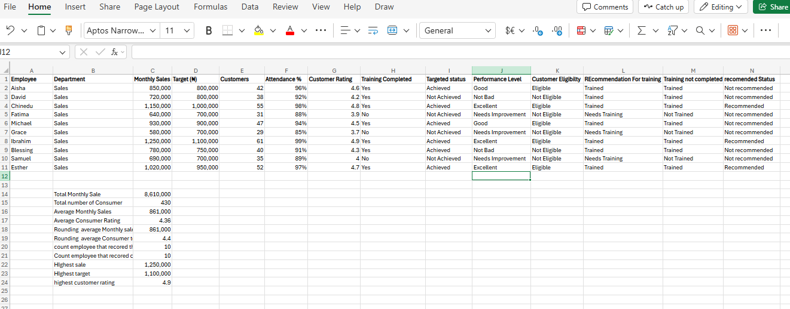

# Learning Portfolio
###📊 **Day 1 in My Excel & Data Analysis Learning Journey**

As I continue learning and improving my Excel skills, I recently put my knowledge of **Mathematical and Logical Functions** into practice using a sales performance dataset.

Instead of just learning the formulas theoretically, I created a practical scenario where I could apply them to real-world business data. This helped me understand how Excel functions can be used to analyse information and support decision-making.

Here are some of the functions I practised:

🔢 **Mathematical Functions**
- • **SUM** – to calculate total sales and customers served.
- • **AVERAGE** – to find the average sales and customer rating.
- • **ROUND** – to make calculated results easier to present and interpret.
- • **COUNT** – to determine the number of records available for analysis.

🧠 **Logical Functions**
- • **IF** – to determine whether employees achieved their sales targets.
- • **IFS** – to classify employees into performance levels such as Excellent, Good, Average, and Needs Improvement.
- • **AND** – to identify employees who met multiple conditions for bonus eligibility.
- • **OR** – to identify employees who may require additional training based on their performance or attendance.
- • **NOT** – to identify employees who had not completed their training.

💡 **What I learned from this practice**

I realised that Excel is not simply about calculating numbers. The real value comes from using those numbers to **answer questions, identify patterns, evaluate performance, and support better decisions**.

For example, combining functions such as **IF and AND** can help management identify employees who qualify for incentives, while **IFS** can make performance classification much easier.

This practical exercise has helped me understand how Excel can be applied to areas such as **business analysis, finance, performance management, planning, and resource allocation**.

I’m still learning, practising, and making mistakes along the way, but every exercise is helping me become more confident with data.

###**Day 2 of My Excel Learning Journey 📊🚀**

Day 2 was another opportunity to move from simply learning Excel functions to **using them to solve real-world business problems**.

Today, I worked with a sales and logistics dataset and practised:

- 🔹 **SUMIF** – calculating total revenue generated by each salesperson
- 🔹 **AVERAGEIF** – finding average revenue per product
- 🔹 **COUNTIF** – counting transactions by product
- 🔹 **IF** – applying country-specific tax rules and identifying orders requiring priority shipping
- 🔹 **Data Analysis** – turning raw transactions into meaningful business insights

One thing I’m learning is that Excel is not just about entering numbers or memorising formulas. It is about **asking the right questions, analysing the data, and using the results to support better decisions.**

I also learned that accuracy matters. A formula can look correct but still produce the wrong result if the criteria or cell ranges are not properly structured.

Every practice session is helping me become more confident with data analysis, one formula at a time. 📈

**Day 2 completed. More learning ahead! 🚀**

